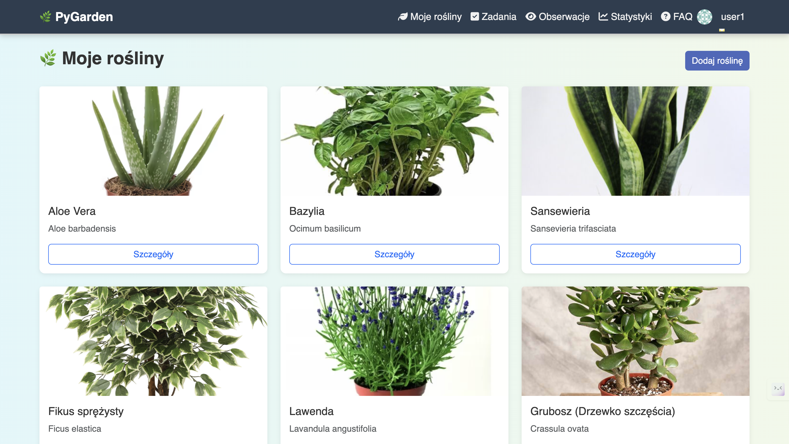
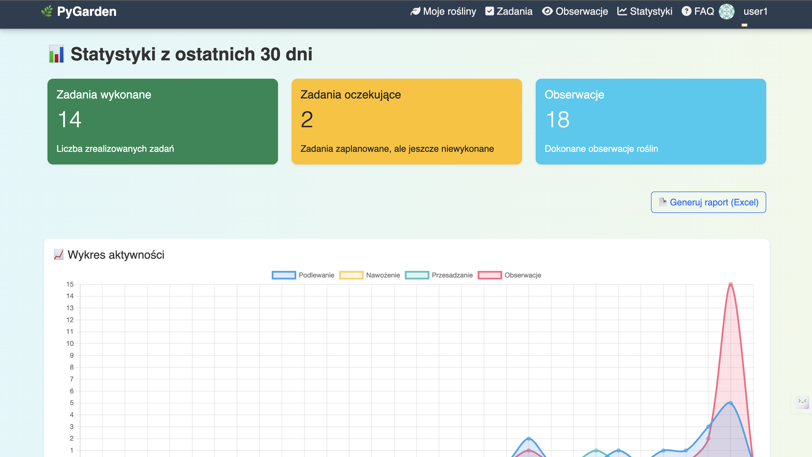
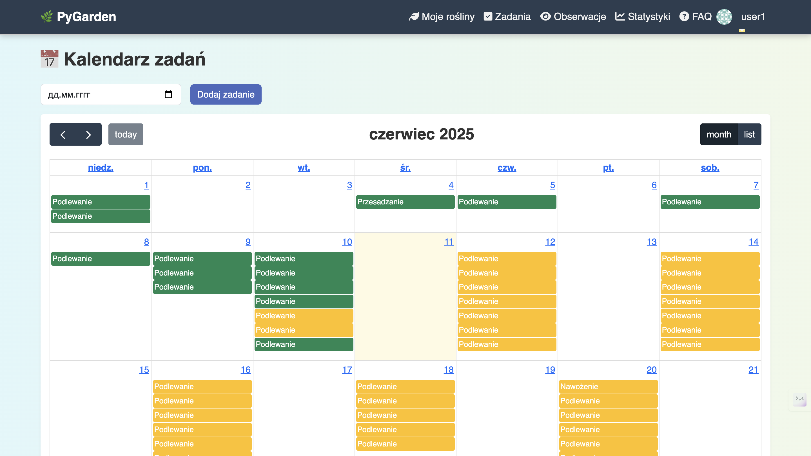

# 🌿 PyGarden

**PyGarden** to inteligentny asystent do zarządzania roślinami domowymi. Pozwala tworzyć zadania pielęgnacyjne, monitorować obserwacje, generować raporty, analizować statystyki i więcej — wszystko w jednym miejscu!

---

## 🚀 Funkcje

- 📅 **Kalendarz zadań** – planuj podlewanie, nawożenie i przesadzanie.
- 🧠 **Powiadomienia** – przypomnienia o zadaniach do wykonania dziś.
- 📸 **Dziennik obserwacji** – zapisuj zdjęcia i notatki o stanie roślin.
- 📊 **Statystyki** – interaktywny wykres aktywności i efektywności pielęgnacji.
- 📥 **Eksport danych** – generuj raporty i kopie zapasowe do pliku Excel/JSON.
- 🧾 **FAQ** – sekcja z najczęściej zadawanymi pytaniami.
- 🦺 **Bezpieczeństwo** – filtrowany dostęp do danych tylko dla zalogowanego użytkownika.

---

## 📷 Zrzuty ekranu

| Strona główna             | Statystyki                  | Kalendarz                     |
|---------------------------|-----------------------------|-------------------------------|
|  |  |  |

---

## 🛠️ Wymagania

- Python 3.10+
- Django 4.x
- SQLite
- Bootstrap 5
- Chart.js / FullCalendar
- Pillow, OpenPyXL

---

## ⚙️ Instalacja

1. Klonuj repozytorium:

```bash
git clone https://github.com/twoj-login/pygarden.git
cd pygarden
